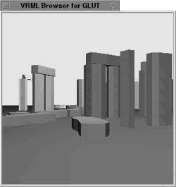
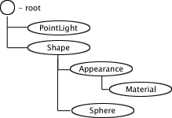
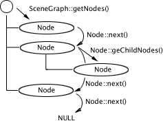
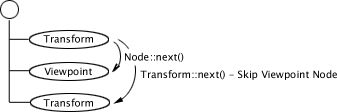
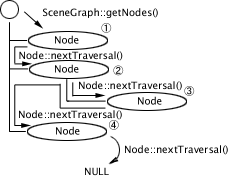

# CyberVRML97 for C++

CyberVRML97 for C++ is a development library for building VRML97/2.0
applications quickly. Using the library, you can read and write the VRML
files, set and get the scene graph information, draw the geometries, run
the behaviors easily.



# Setup

The CyberVRML97 library is consist of some C++ program source files and
two parser syntax files. To use the library, you have to create two
parser source files from the parser syntax, and you make the library
using the source files or add the source files into your project.

## System Requirements

To use the CyberVRML97 library on your platform, you have to prepare the
following software on your platform.

- C++ compiler
- Parser generators (lex and yacc)

If your C++ compiler supports STL package, you can get the more
performance to load VRML files, and access to the scene graph with a
compiler option.

## Building Parser Files

The CyberVRML97 has the following two parser syntax files, and you have
to create the parser source files using lex/yacc generators.

| File Name | Detail                                |
|-----------|---------------------------------------|
| vrml.l    | a lex syntax file of the CyberVRML97  |
| vrml.y    | a yacc syntax file of the CyberVRML97 |

In the following example, the parser source files, "vrml.tab.h" and
"vrml.yy.cpp" are created using GNU parser generators, Flex and Bison.

````
bison -ydv vrml.y
mv y.tab.c vrml.tab.cpp
mv y.tab.h vrml.tab.h
flex -I vrml.l
mv lex.yy.c vrml.yy.cpp
````

## Compiler Flags

If you create the library with no compiler flags, you can only load VRML
files, edit the scene graph information, and output the scene graph into
a VRML file.

The CyberVRML97 has some the following compiler options. Depending on
your purpose, set the flags into your compiler.

| Compiler Flag                 | Purpose                                       | Requirements                     |
|-------------------------------|-----------------------------------------------|----------------------------------|
| SUPPORT_OPENGL                | Drawing geometry nodes using OpenGL           | OpenGL 1.x library               |
| SUPPORT_GLUT                  | Drawing geometry nodes using GLUT with OpenGL | GLUT 3.x library                 |
| SUPPORT_JPEG                  | Loading JPEG image files in ImageTexture node | Independent JPEG Group's library |
| SUPPORT_PNG                   | Loading JPEG image files in ImageTexture node | libpng / zlib                    |
| SUPPORT_JSAI                  | Executing behaviors in Script nodes.          | "Sun JRE 1.1.x                   |
|  CyberVRML97 for Java 1.0.2a" |
| SUPPORT_OLDCPP                | Supports some old c++ compilers.              | None                             |
| SUPPORT_STL                   | Get good performance                          | STL package                      |

# Scene Graph

In the CyberVRML97, the scene graph is correction and hierarchical
arrangement of VRML nodes.

There are two ways to build a scene graph dynamically, you can load it
from a VRML file, or you can create new VRML node and add the node into
the scene graph.

## Loading Scene Graph

Use SceneGraph::load() to load a scene graph from a VRML file. The
load() clears all VRML nodes in the current scene graph.

````
SceneGraph *sceneGraph = new SceneGraph();
sceneGraph->load("world.wrl");
````

If your scene graph has some VRML nodes and you want to add a new scene
graph from a VRML file into the current scene graph, use
SceneGraph::add().

````
SceneGraph *sceneGraph = new SceneGraph();
....
sceneGraph->add("world.wrl");
````

If ScneGraph::load() or SceneGraph::add() can't read your VRML file
normally, the methods return false. Use the following methods to know
the error in more detail.

````
int SceneGraph::getParserErrorLineNumber(void);
char *SceneGraph::getParserErrorMessage(void);
char *SceneGraph::getParserErrorToken(void);
char *SceneGraph::getParserErrorLineString(void);
````

The following example shows the parser error when the loading is failed.

````
SceneGraph *sceneGraph = new SceneGraph();
bool result = sceneGraph->load("world.wrl");
if (result == false) {
    printf("\$s (%d) : %s",
    sceneGraph.getParserErrorMessage(),
    sceneGraph.getParserErrorLineNumber(),
    sceneGraph.getParserErrorToken());
}
````

## Building Scene Graph

The CyberVRML97 has all C++ classes of VRML nodes, you can add and
remove the all nodes dynamically. Use SceneGraph::addNode() to add a new
node as a root node of the scene graph. Use Node::addChildNode() to add
a new node as a child node of the other node.

The following example adds a PointLight and Shape node that has an
appearance and a geometry node into an empty scene graph.


````
// Add a PointLight node

PointLightNode *plight = new PointLightNode();\

// Add a Shape node as a root node

ShapeNode *shape = new ShapeNode();
sg.addNode(shape);

// Add an Appearance node as a child node of the Shape node

Appearancenode *app = new AppearanceNode();
shape->addChildNode(app);

// Add a Material node as a child node of the Appearance node

MaterialNode *mat = new MaterialNode();
mat->setDiffuseColor(1.0f, 0.0f, 0.0f); // Red
app->addChildNode(mat);

// Add a Sphere node as a child node of the Shape node

SphereNode *sphere = new SphereNode();
shape->addChildNode(sphere);
sphere->setRadius(10.0f);
````

Use Node::remove() to remove a node from the current scene graph. The
following example uses Node::remove() to remove a PointLight node from a
loaded scene graph.

````
SceneGraph sg;
sg.load("world.wrl");

// Remove first PointLight node

PointLightNode *plight = sg.findPointLightNode();
if (plight != NULL)
    plight->remove();
````

## Scene Graph Output

Use SceneGraph::save() to save a current scene graph into a VRML file.

```
sceneGraph->save("newworld.wrl");
```

Use SceneGraph::print() to output a current scene graph into a default
console.

sceneGraph->print();

## Scene Graph Traversal

The scene graph has the VRML information as a collection of Node class
instances. The Node class is a super class of all VRML node classes of
CyberVRML97. There are two ways to access the nodes.

The first way is to use SceneGraph::getNodes() with Node::next() and
Node::getChildNodes(). For example, if you want to get all viewpoint
nodes in a scene graph .....

```
void GetViewpointInfomation(Node *node) {
    if (node->isViewpointNode()) {
    ViewpointNode *view = (Viewpoint *)node;
    // Get a viewpoint information
    ....
}

for (Node *cnode=node->getChildNodes(); cnode; cnode=cnode->next()) {
    GetViewpointInfomation(cnode);
}

void main() {
    ....
    SceneGraph *sg = new SceneGraph();
    sceneGraph->load("world.wrl");
    for (Node *node=sg->getNodes(); node; node=node->next())
    GetViewpointInfomation(node);
    ....
}
```

SceneGraph::getNodes() returns a first node that are added into the
scene graph root. Node::next() returns a next node in the same
hierarchy, Node::getChildNodes() returns a first child node that are
added into the parent node. The methods returns NULL if the next node
does not exist.



Node::next() is overridden in all sub classes, TransformNode class etc.
The overridden method returns a next same class node. For example,
Transform::next() returns a next Transform node.



The other way is to use SceneGraph::getNodes()with
Node::nextTraversal(). The way is handier than the first one. For
example, if you want to get all viewpoint nodes in the scene graph

```
void main() {
    ....
    SceneGraph *sg = new SceneGraph();
    sg->load("world.wrl");
    for (Node *node=sg->getNodes(); node; node=node->nextTraversal()) {
        if (node->isViewpoint()) {
            ViewpointNode *view = (ViewpointNode *)node;
            // Get a viewpoint information
            ....
        }
    }
    ....
}
```

Node::nextTraversal() is similar to Node::next(), but
Node::nextTraversal tries to get a next node from the parent node when
the next node does not exist. This Node::nextTraversal() is overridden
in the sub classes to return a next same class node, too.



If you want to get only same class nodes, use
SceneGraph::find<nodetype>Node() instead of SceneGraph::getNodes()
with the <nodetype>::nextTraversal() that returns a next same class
node. For example, if you want to get only all viewpoint nodes in the
scene graph.

```
SceneGraph *sg = new SceneGraph();
sg->load("world.wrl");
for (ViewpointNode *view=sceneGraph->findViewpointNode(); view; view=view->nextTraversal()) {
    // Get a viewpoint information
    ....
}
```

## Finding Node

Use SceneGraph::findNode() to find a named node by DEF keyword or
Node::setName(). The following example loads a VRML file, "world.wrl",
and gets a node that is named as "MountFuji".

```
SceneGraph sg;
sg.load("world.wrl")
Node *node = sg.findNode("MountFuji");
```

Use SceneGrahp::get<nodetype>Nodes() to get a specified first node
from the root hierarchy. For example, you want to get a viewpoint that
is a first viewpoint node in the scene graph root, use SceneGraph::getViewpointNodes().

```
SceneGraph sg;
sg.load("world.wrl")
ViewpointNode *defaultView = sg.getViewpointNodes();
```

# Node

The CyberVRML97 node name is identical to the VRML node name. For
example, you would use the BoxNode class if you want to use the Box
node.

## Creating Node

The node class has the default constructor only. Use the default
constructor to create the new node, and set the field property. The
following example creates a sphere and set the property.

```
SphereNode *spNode = new SphereNode();
spNode->setRadius(10.0);
```

## Node Type

If you want to know the node type, use Node::getType() or
Node::is<nodetype>Node();

Node::getType() returns the node type as a string,
Node::is<nodetype>Node() returns true when the node is the specified
type. For example, you want to know whether a node is ViewpointNode.

```
SceneGraph *sg = new SceneGraph();
sg->load("world.wrl");
for (Node *node=sg->getNodes(); node; node=node->nextTraversal())
    char *nodeType = node->getType();
    if (node->isViewpoint() \|\| strcmp(nodeType, "Viewpoint") == 0)
        printf("This node is ViewpointNode !!");
}
```

## Node Name

If you load a VRML file that has some named nodes by DEF keyword, you
can get the name using Node::getName(); Use Node::setName() to name a
node.

```
SceneGraph sg;
sg.load("world.wrl")
ShapeNode *mtNode = sg.getShapeNodes();
mtNode->setName("MtFuji");
```

The named nodes are output using DEF keyword when you save the scene
graph.

```
#VRML V2.0 utf8
....
DEF MtFuji Shape {
....
}
....
```

## Accessing Fields 

The node class has set<fieldname>() and get<fieldname>() to access
to the VRML fields, and has getN<fieldname>s() if the field is multi
field, MFString etc.. For example, the AnchorNode class has the
following methods.

```
class AnchorNode {
    void setDescription(char *value);
    char * getDescription();
    void addParameter(char *value);
    int getNParameters();
    char * getParameter(int index);
    void addUrl(char *value);
    int getNUrls();
    char * getUrl(int index);
    void setUrl(int index, char *urlString);
};
```

The Node classes has only basic field access methods. Use
get<fieldname>Field() to access the field in more detail. The method
returns the field class itself. You can operate the field in more detail
to the field class. The following example gets a color field of a Color
Node in an IndexedFaceSet node, and changes all the colors to red.

```
IndexedFaceSetNode *idxNode = ......
ColorNode *colNode = idxNode->getColorNodes();
MFColor *colField = colNode->getColorField();
int colCnt = colField->size();
for (int n=0; n<colCnt; n++)
    colField->set1Value(n, 0xff, 0x00, 0x00) // Red
```

## Adding to Scene Graph

Use SceneGraph::addNode() to add the node as a root node of the scene
graph. The following example creates a transform node add the node to
the scene graph root.

```
SceneGraph sg;
TransformNode *transNode = new TransformNode();
sg.addNode(transNode);
```

## Adding Child Node

Use Node::addChildNode() to add the node as a child node of the other
node. The following example creates a shape and a box, add the shape to
the scene graph root, and add the box to the shape.

```
SceneGraph sg;
ShapeNode *shapeNode = new ShapeNode();
BoxNode *boxNode = new BoxNode();
sg.addNode(shapeNode);
shapeNode.addChileNode(boxNode);
```

## Getting Child Node

There are two ways to get child nodes. The first way is to use
Node::getNChildNodes() that returns a count of child nodes, and
Node::getChileNode() that returns a selected child node. The following
example shows the name and the type of all child nodes.

```
void PrintChildNodes(Node *node) {
    int childNodeCnt = node->getNChildNodes();
    for (int n=0; n<childNodeCnt; n++) {
        Node *childNode = node->getChildNode(n);
        char *nodeType = childNode->getType();
        char *nodeName = childNode->getName();
        printf("[%d] = %s, %s", n, nodeType, nodeName);
    }
}
```

The other way is to use Node::getChildNodes() that returns a first child
node with Node::next() returns a next child node in the same parent
node. The Node::getChildNodes() and the Node::next() returns NULL if the
node does not exist. The way is handier and faster than the first one.
The following example shows the name and the type of all child nodes.

```
void PrintChildNodes(Node *node) {
    Node *childNode = node->getChildNodes();
    while (childNode!= NULL) {
        char *nodeType = childNode->getType();
        char *nodeName = childNode->getName();
        printf("[%d] = %s, %s", n, nodeType, nodeName);
        childNode = childNode->next();
    }
}
```

## Removing from SceneGraph or Parent Node

Use Node::remove() to remove a node from the scene graph root or the
parent node. The following example removes a point light from the scene
graph.

```
SceneGraph sg;
....

PointLightNode *plight = sg.findPointLightNode();
if (plight != NULL)
    plight->remove();

To remove and delete a node, you should call the destructor simply
because the destructor of Node classes removes the node from the scene
graph root or the parent node if the node is added before the node is
deleted.

SceneGraph sg;

....

PointLightNode *plight = sg.findPointLightNode();
if (plight != NULL)
    delete plight;
```

## Instance Node

You can create an instance of a node like USE keyword of VRML97. Use
Node::createInstanceNode() to create the instance node.

```
SceneGraph sg;
ShapeNode *shape = new ShapeNode();
shape->setName("BOX");
BoxNode *box = new BoxNode();
box->setSize(10.0, 20.0, 30.0);
sg.addNode(shape);
shape->addChildNode(box);
Node *shapeInstance = shape->createInstanceNode();
sg.addNode(shapeInstance);
```

The scene graph is output as the following when you save the scene
graph.

```
DEF BOX Shape {
    geometry Box {
        size 10 20 30
    }
}
USE BOX
```

# Field

The node has several fields and the field is a property or attribute of
a node. The field is identical to the VRML field name. For example, you
would use the SFBool class if you want to use the SFBool field.

Use get<fieldname>Field() to get the field. The following example gets
a color field of a Color Node in an IndexedFaceSet node, and changes all
the colors to red.

```
IndexedFaceSetNode *idxNode = ......
ColorNode *colNode = idxNode->getColorNodes();
MFColor *colField = colNode->getColorField();
int colCnt = colField->size();
for (int n=0; n<colCnt; n++)
    colField->set1Value(n, 0xff, 0x00, 0x00) // Red
```

# OpenGL

The CyberVRML97 supports the geometry rendering using OpenGL. All
geometry classes are sub class of the GeometryNode class, and has a
rendering methods, GeometryNode::draw(), if you compile the library with
the SUPPORT_OPENGL option;

The geometry node has the display list of OpenGL, use
ScenegGraph::initialize() or Node::initialize() to create the display
list. Use GeometryNode::getDisplayList() to get the display list number.
Because the display list has only the vertices information, you should
set the transform and the appearance information before the geometry
drawing.

The following function sets only the material and transform information
for the geometry drawing. See the other samples, VRML browser using the
CyberVRML97 etc., about the implementation in more detail.

```
void DrawShapeNode(ShapeNode *shape) {
    glPushMatrix ();

    float color[4];
    color[3] = 1.0f;

    AppearanceNode *appearance = shape->getAppearanceNodes();
    MaterialNode *material = NULL;

    if (appearance) {
        material = appearance->getMaterialNodes();
        if (material) {
            float ambientIntesity = material->getAmbientIntensity();
            material->getDiffuseColor(color);
            glMaterialfv(GL_FRONT_AND_BACK, GL_DIFFUSE, color);
            material->getSpecularColor(color);
            glMaterialfv(GL_FRONT_AND_BACK, GL_SPECULAR, color);
            material->getEmissiveColor(color);
            glMaterialfv(GL_FRONT_AND_BACK, GL_EMISSION, color);
            material->getDiffuseColor(color);
            color[0] *= ambientIntesity;
            color[1] *= ambientIntesity;
            color[2] *= ambientIntesity;
            glMaterialfv(GL_FRONT_AND_BACK, GL_AMBIENT, color);
            glMateriali(GL_FRONT, GL_SHININESS, (int)(material->getShininess()*128.0));
        }
    }

    float m4[4][4];
    shape->getTransformMatrix(m4);
    glMultMatrixf((float *)m4);
    GeometryNode *gnode = shape->getGeometry();
    if (gnode) {
        if (0 < gnode->getDisplayList())
            gnode->draw();
    }

    glPopMatrix();
}
```

# Other Notes

## PROTO

Only the SFfields are supported, and the MFfields are
ignored. EXTERNPROTO is not supported.

## Script

Java of VRML 2.0 specification (JSAI) is supported as the script
language. In current version, the processEvents() method and the
eventsProcessed() method are not supported.

# License

CyberVRML97 for C++ is provided "AS IS". Licenser disclaims all
warranties, including but not limited to, all express or implied
warranties of merchant ability and fitness for a particular purpose.

Everyone can use the CyberVRML97 for commerce or personal purposes free.
However, If you want to distribute your software using the CyberVRML97,
you have to add state that "Portions of this software is based in part
on the CyberVRML97 package written by Satoshi Konno" into the program
or document.

